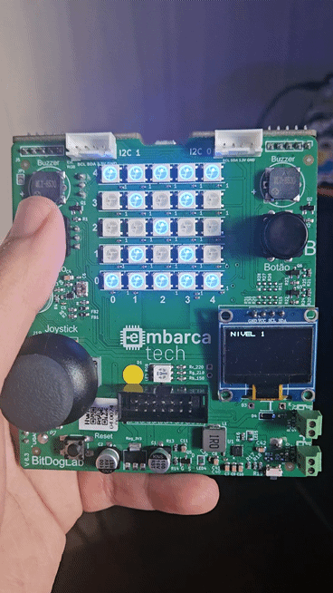

# Tarefa: Roteiro de FreeRTOS #2 - EmbarcaTech 2025

Autores: **João Vitor Silva do Espirito Santo e Yan Andrade de Sena**

Curso: Residência Tecnológica em Sistemas Embarcados

Instituição: EmbarcaTech - HBr

Brasília, Julho de 2025

---

# Teste de tempo de reação de escolha (CRT - Choice Reaction Time)

Este projeto implementa um teste de reaçaõ de escolha, normalmente utilizado para testar a capacidade de reação de uma 
pessoa que queira realizar o processor de tirar a carteira nacional de habilitação (CNH).

## Objetivo

Criar um sistema utilizando FreeRTOS, escolhendo ao menos um periférico disponível na placa.

No nosso projeto separamos uma tarefa para cada periférico que escolhemos:

- Uma Tarefa para administrar o acionamento dos botões
- Uma tarefa para ler o joystick
- Uma tarefa para exibir as informações no OLED
- Uma tarefa para exibir a direção da seta e a ampulheta na matriz de LED
- Uma tarefa que processa todo o exame, ou seja, lê os dados captados pelo joystick e dependendo dos dados define o que exibir no OLED e na matriz de LED

## Lista de Materiais

| Componente            | Conexão na BitDogLab         |
|-----------------------|------------------------------|
| BitDogLab (RP2040)    | -                            |
| Display OLED I2C      | SDA: GPIO14 / SCL: GPIO15    |
| Botão A               | GPIO5                        |
| Botão B               | GPIO6                        |
| Joystick (eixo X)	    | GPIO27 (ADC1)                |
| Joystick (eixo Y)	    | GPIO26 (ADC0)                |
| Joystick (botão)	    | GPIO22                       |
| Matriz WS2812B 5x5	| GPIO7                        |
	
## Execução

1. Abra o projeto no VS Code com ambiente configurado para Raspberry Pi Pico (CMake + compilador ARM)
2. Compile o projeto (Ctrl+Shift+B no VS Code ou via terminal com cmake e make)
3. Conecte a BitDogLab via USB no modo de boot (pressione BOOTSEL enquanto conecta)
4. Copie o arquivo .uf2 gerado para a unidade RPI-RP2
5. A placa reiniciará automaticamente e exibirá a tela inicial

# Lógica

- A tela inicial irá exibir o nivel (1 a 4) de dificuldade do teste
- Será exibido na matriz de led uma ampulheta que irá iniciar o teste
- Setas serão exibidas para indicar a direção do joystick que deve ser apontado
- Ao final do teste será exibido o tempo marcado para cada teste

## Funcionalidades

- **Botão A**: Inicia um teste de de reação
- **Botão B**: Muda o nível de dificuldade
- **Joystick**: Serve para indicar a posição solicitada pela matriz de LED
- **Matriz LED**: Indica a posição que o joystick deve ser apontado
- **TELA OLED**: Exibe o tempo de reação

## Demonstração Visual

Aqui estão algumas capturas do projeto em funcionamento:

  <h3>Tela inicial</h3>
  
  
<em>Aperte o botão A para iniciar o teste</em>

  <h3>Matriz de LED exibindo direção</h3>
  
  
<em>Matriz de LED indicando para onde o joystick deve ser apontado</em>

  <h3>OLED exibindo o tempo de reação de cada teste</h3>
  
  
<em>Visualização do tempo de cada teste</em>

## Vídeo do funcionamento

Aqui está o vídeo do funcionamento

[Vídeo](https://youtube.com/shorts/gPiC9UXQgAo?si=cSjtpc208SyGL7C5)

## Arquivos

- `src/main.c`: Código principal
- `src/exam.c`: Código onde está a lógica do exame de reação
- `src/joystick.c`: Código onde configura e lê os dados captados pelo joystick 
- `src/neopin.c`: Código onde configura e controla a matriz de LED 
- `src/oled_ctrl.c`: Código onde configura e controla o display OLED
- `include/exam.h`: Header do exam.c
- `include/joystick.h`: Header do  joystick.c 
- `include/neopin.h`: Header do neopin.c
- `include/oled_ctrl.h`: Header do oled_ctrl.h
- `include/ssd1306.h`: Driver para o display OLED

---

## 📜 Licença
GNU GPL-3.0.
